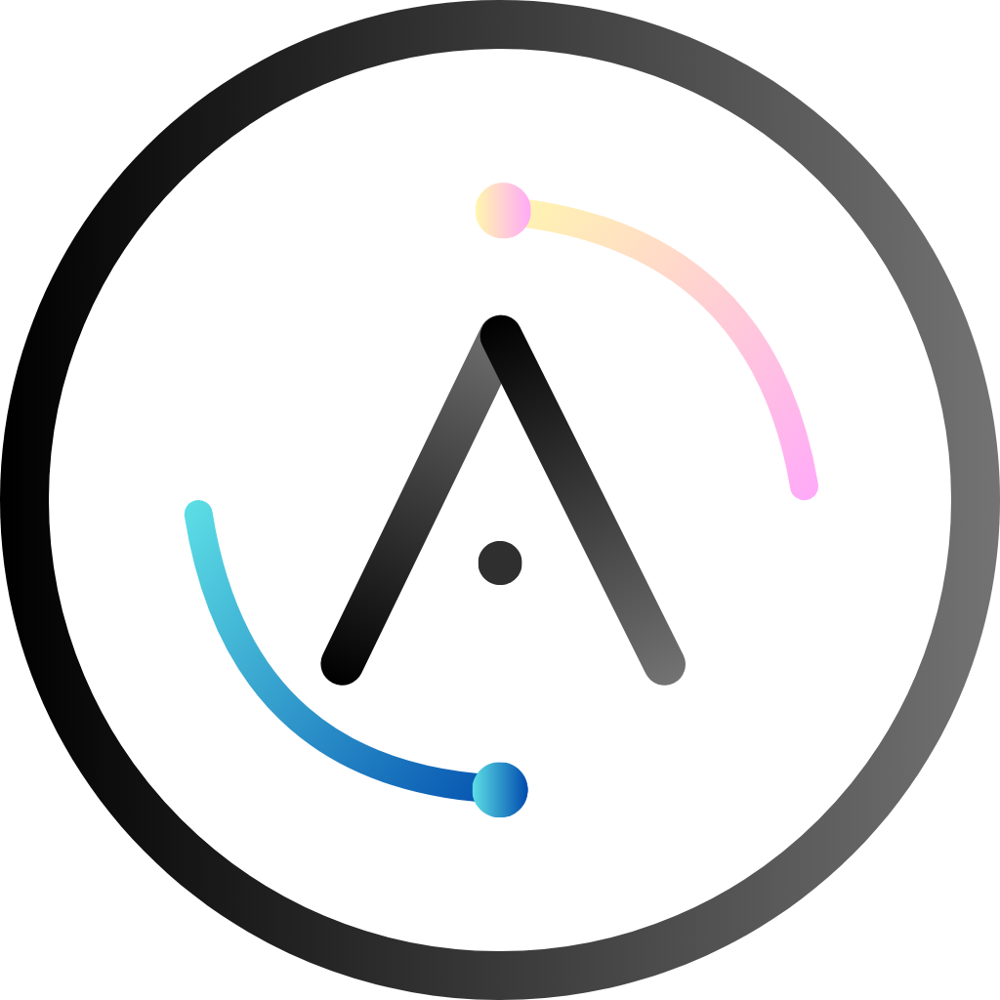
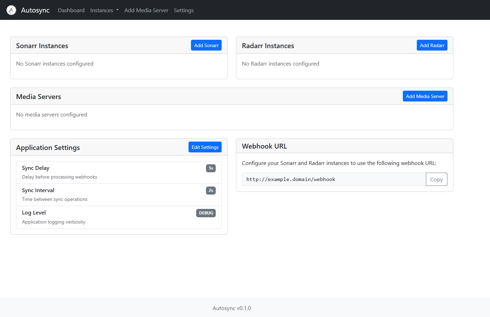
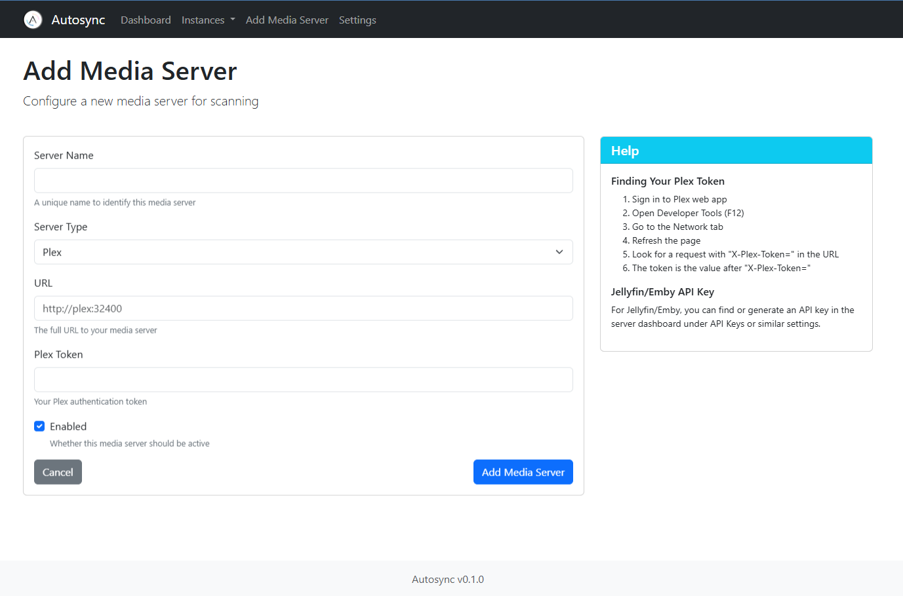
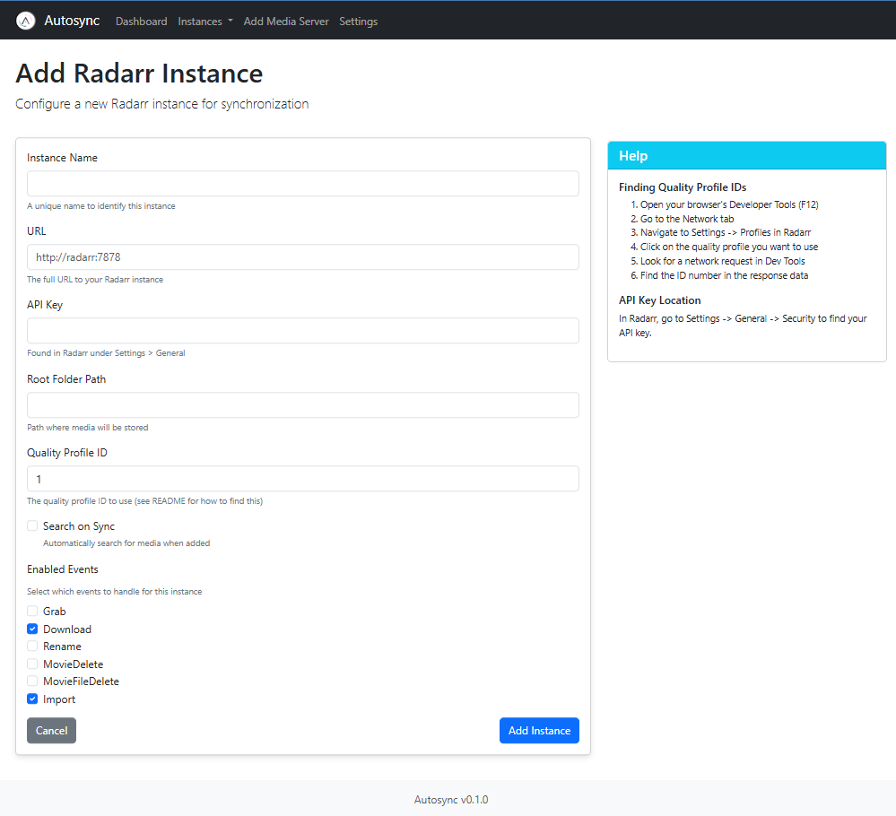
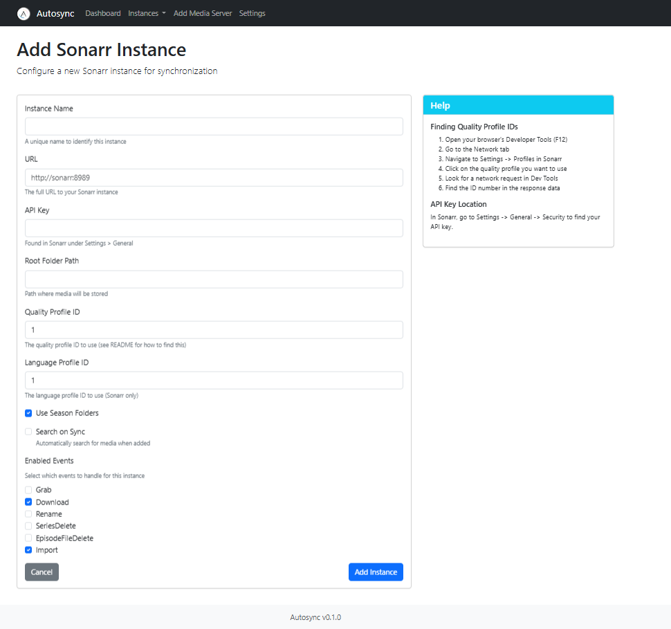
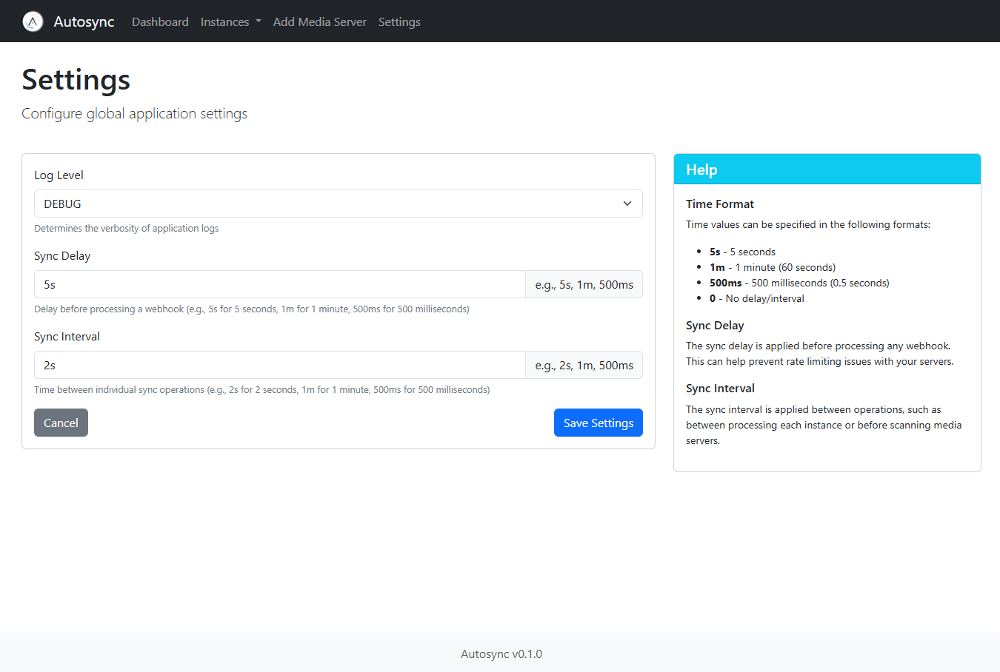

<div align="center">
  <a href="https://github.com/Pukabyte/autosync">
    <picture>
      <source media="(prefers-color-scheme: dark)" srcset="static/img/logo.png" width="400">
      
    </picture>
  </a>
</div>

<div align="center">
  <a href="https://github.com/Pukabyte/autosync/stargazers"></a>
  <a href="https://github.com/Pukabyte/autosync/issues"></a>
  <a href="https://github.com/Pukabyte/autosync/blob/main/LICENSE"></a>
  <a href="https://github.com/Pukabyte/autosync/graphs/contributors"></a>
  <a href="https://discord.gg/vMSnNcd7m5"></a>
</div>

<div align="center">
  <p>Autoscan meets Syncarr.</p>
</div>

# Autosync

Autosync is a webhook service that synchronizes downloads across multiple Sonarr and Radarr instances. 
When one instance imports a movie or TV show, Autosync automatically adds it to your other instances with matching quality profiles. 
It also supports scanning media servers for new content upon import.

## Features

- Synchronizes downloads between multiple Sonarr instances
- Synchronizes downloads between multiple Radarr instances
- Docker support for easy deployment
- Media server scanning for new content
- Web UI for configuration management

## Prerequisites

- Docker and Docker Compose
- Sonarr and Radarr using API v3
- Media server configured in config.yaml

## Docker Installation

1. Clone this repository:
   ```bash
   git clone https://github.com/pukabyte/autosync.git
   cd autosync
   ```

2. Create your configuration file:
   ```bash
   cp config.example.yaml config.yaml
   ```

3. Create a docker-compose.yml file:
   ```bash
   cp docker-compose.example.yml docker-compose.yml
   ```

4. Edit the configuration file with your settings:
   ```bash
   nano config.yaml
   ```

5. Build and start the container:
   ```bash
   docker compose up -d
   ```

#### Docker Compose Example

```yaml
version: "3"
services:
  autosync:
    image: ghcr.io/pukabyte/autosync:latest
    container_name: autosync
    ports:
      - "3536:3536"
    volumes:
      - ./config.yaml:/app/config.yaml:ro
    restart: unless-stopped
```

## Web Interface

Autosync includes a web interface for managing your configuration that you can access at:

```
http://your-server-ip:3536
```

View logs:

```bash
docker logs -f autosync
```
## Screenshots

Here are some screenshots of the Autosync web interface:

### Dashboard


### Media Server Configuration


### Radarr Instance Configuration


### Sonarr Instance Configuration


### Settings


## Configuration

### config.yaml

The configuration file supports multiple Sonarr and Radarr instances, media servers, and webhook event types. Here's an example:

```yaml
# Define supported event types
webhook_events:
  sonarr:
    - "Grab"
    - "Download"
    - "Rename"
    - "SeriesDelete"
    - "EpisodeFileDelete"
    - "Import"
  radarr:
    - "Grab"
    - "Download"
    - "Rename"
    - "MovieDelete"
    - "MovieFileDelete"
    - "Import"

# Media Servers
# You can add multiple media servers of the same type
media_servers:
  - name: "instance_name"
    type: "plex"
    url: "http://plex:32400"
    token: "api_key"
    enabled: true

  - name: "instance_name"
    type: "jellyfin"
    url: "http://jellyfin:8096"
    api_key: "api_key"
    enabled: true

  - name: "instance_name"
    type: "emby"
    url: "http://emby:8096"
    api_key: "api_key"
    enabled: true

# Sonarr and Radarr Instances
# You can add multiple instances of the same type
instances:
  - name: "instance_name"
    type: "sonarr"
    url: "http://sonarr4k:8989"
    api_key: "api_key"
    root_folder_path: "/path/to/shows4k"
    season_folder: true
    quality_profile_id: 8
    language_profile_id: 1
    search_on_sync: true
    enabled_events:
      - "Grab"
      - "Import"

  - name: "instance_name"
    type: "radarr"
    url: "http://radarr4k:7878"
    api_key: "api_key"
    root_folder_path: "/path/to/movies4k"
    quality_profile_id: 8
    search_on_sync: true
    enabled_events:
      - "Grab"
      - "Import"
```

### Finding Quality Profile IDs

To find your quality profile IDs:

1. Open your browser's Developer Tools (usually F12)
2. Go to the Network tab in Developer Tools
3. Navigate to Settings -> Profiles in Sonarr/Radarr
4. Click on the quality profile you want to use
5. Look for a network request in Dev Tools when the profile loads
6. Find the ID number in the response data

Note: While there might be easier ways to find these IDs, this method is reliable and works across both Sonarr and Radarr. The profile ID is usually visible in the API response when loading or saving a profile.

### Configuration Options

#### Media Server Options

- `name`: Unique name for the media server
- `type`: Must be "plex", "jellyfin", or "emby"
- `url`: Full URL to your media server
- `token`: Media server API key

#### Sonarr Instance Options

- `name`: Unique name for the instance
- `type`: Must be "sonarr"
- `url`: Full URL to your Sonarr instance
- `api_key`: Sonarr API key (found in Settings -> General)
- `root_folder_path`: Path where media will be stored
- `season_folder`: Whether to create season folders (true/false)
- `quality_profile_id`: Quality profile ID to use (see note below on finding this)
- `language_profile_id`: Language profile ID to use
- `search_on_sync`: Whether to trigger search when adding (true/false)
- `enabled_events`: List of webhook events to handle for this instance

#### Radarr Instance Options

- `name`: Unique name for the instance
- `type`: Must be "radarr"
- `url`: Full URL to your Radarr instance
- `api_key`: Radarr API key (found in Settings -> General)
- `root_folder_path`: Path where media will be stored
- `quality_profile_id`: Quality profile ID to use
- `search_on_sync`: Whether to trigger search when adding (true/false)
- `enabled_events`: List of webhook events to handle for this instance

### Supported Webhook Events

#### Sonarr Events
- `Grab`: Triggered when an episode is grabbed
- `Import`: Triggered when an episode file is imported
- `Download`: Triggered when a download is completed
- `Rename`: Triggered when files are renamed
- `SeriesDelete`: Triggered when a series is deleted
- `EpisodeFileDelete`: Triggered when episode files are deleted

#### Radarr Events
- `Grab`: Triggered when a movie is grabbed
- `Import`: Triggered when a movie file is imported
- `Download`: Triggered when a download is completed
- `Rename`: Triggered when files are renamed
- `MovieDelete`: Triggered when a movie is deleted
- `MovieFileDelete`: Triggered when movie files are deleted

## Setting Up Webhooks in Sonarr and Radarr

1. Go to Settings -> Connect
2. Click the + button to add a new connection
3. Select "Webhook"
4. Configure:
   - Name: Autosync
   - Triggers: Select the events you want to handle (e.g., "On Grab", "On Import")
   - URL: http://autosync:3536/webhook

### Debug Logs

To enable debug logging, set the `log_level` in config.yaml to `DEBUG`.

## Contributing

Contributions are welcome! Please feel free to submit a Pull Request.